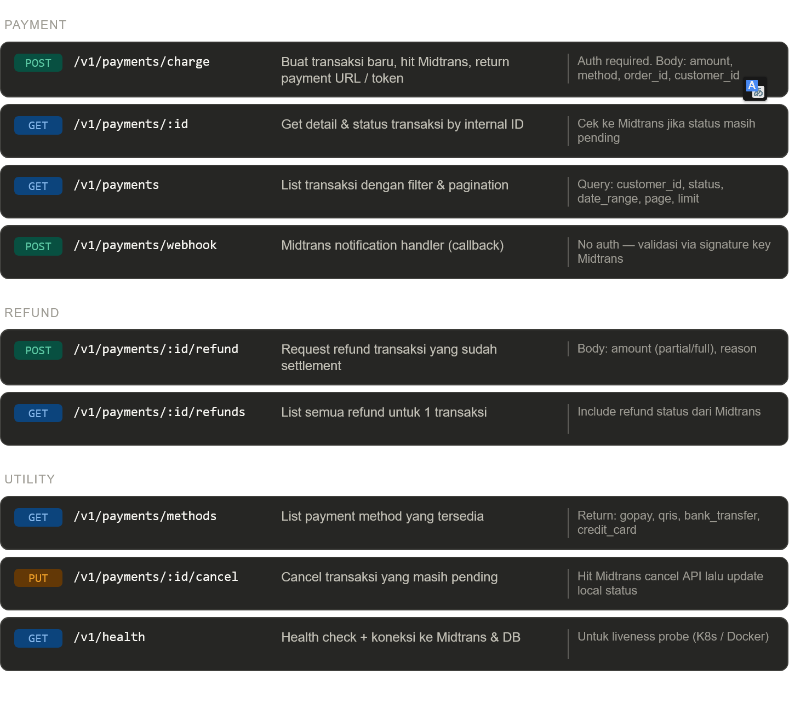
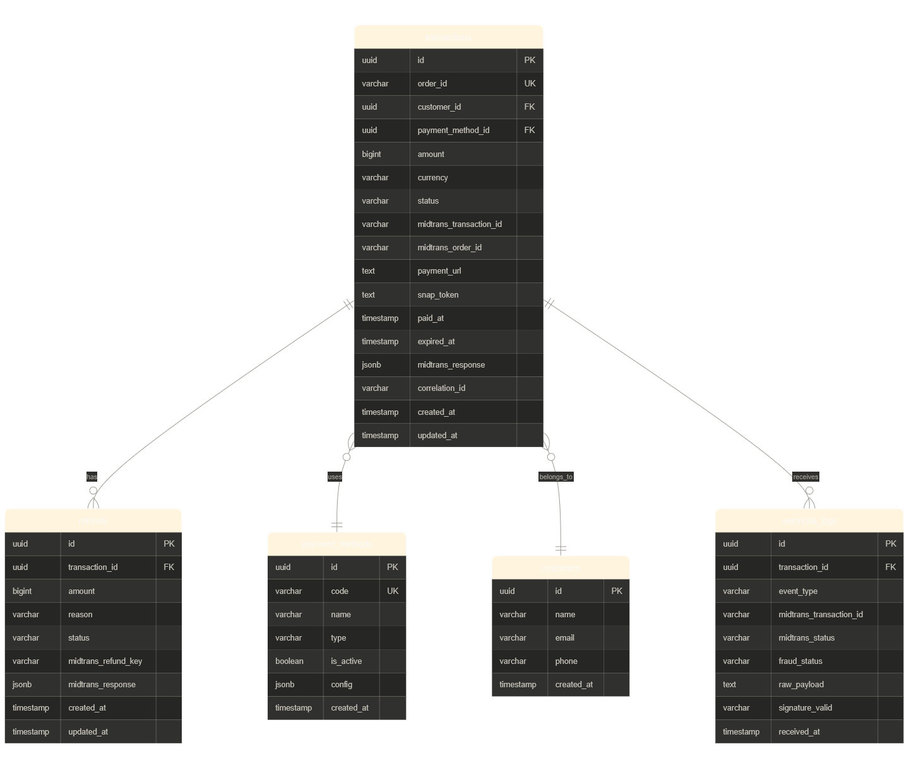
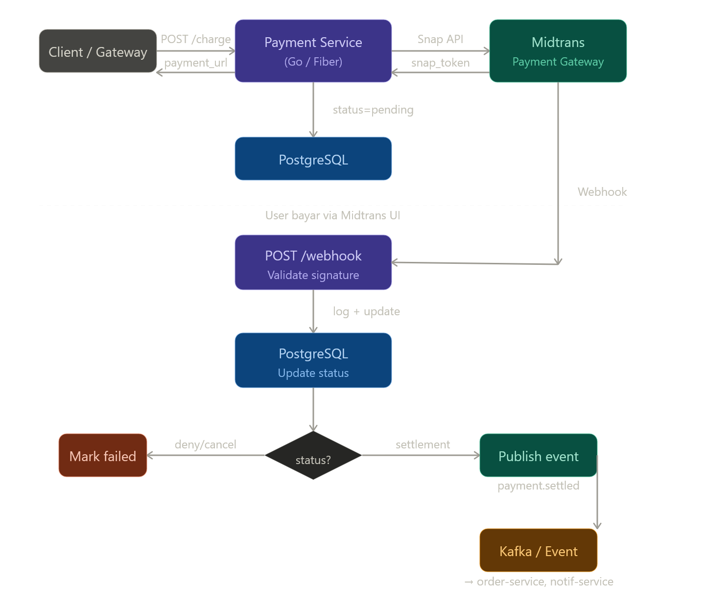

**Arsitektur overview:** Payment Service nerima request dari API Gateway/client, hit Midtrans API, simpan state ke PostgreSQL, dan handle webhook callback dari Midtrans untuk update status transaksi.

---

### Endpoint design---

### Database Schema (PostgreSQL)---

### Payment Flow (Charge → Webhook → Settlement)---

### Detail penting tiap tabel

**`transactions`** — tabel utama. Field `status` pakai `VARCHAR` dengan CHECK constraint: `pending | settlement | cancel | deny | expire | failure`. Kolom `midtrans_response` tipe `jsonb` buat nyimpen raw response Midtrans biar audit-friendly. `correlation_id` untuk distributed tracing antar service.

**`webhook_logs`** — append-only, jangan pernah di-update. Tiap notif dari Midtrans masuk sini dulu sebelum diproses. Ini penting karena Midtrans bisa kirim webhook yang sama lebih dari sekali — lo validasi signature-nya di sini, terus cek duplikasi via `midtrans_transaction_id`.

**`refunds`** — relasi ke `transactions`. Satu transaksi bisa punya multiple refund (partial refund). Status refundnya independen dari status transaksi.

**`payment_methods`** — master data. Kolom `config` pakai `jsonb` buat nyimpen config spesifik tiap method (misal: VA bank list untuk bank_transfer, expiry time untuk QRIS).

---

### SQL schema (siap Flyway)

```sql
-- V1__create_payment_service_tables.sql

CREATE EXTENSION IF NOT EXISTS "uuid-ossp";

CREATE TABLE payment_methods (
    id              UUID PRIMARY KEY DEFAULT uuid_generate_v4(),
    code            VARCHAR(50) UNIQUE NOT NULL,  -- gopay, qris, bca_va
    name            VARCHAR(100) NOT NULL,
    type            VARCHAR(50) NOT NULL,          -- ewallet, bank_transfer, card, qris
    is_active       BOOLEAN NOT NULL DEFAULT true,
    config          JSONB,
    created_at      TIMESTAMPTZ NOT NULL DEFAULT NOW()
);

CREATE TABLE customers (
    id              UUID PRIMARY KEY DEFAULT uuid_generate_v4(),
    name            VARCHAR(200) NOT NULL,
    email           VARCHAR(200),
    phone           VARCHAR(20),
    created_at      TIMESTAMPTZ NOT NULL DEFAULT NOW()
);

CREATE TABLE transactions (
    id                        UUID PRIMARY KEY DEFAULT uuid_generate_v4(),
    order_id                  VARCHAR(100) UNIQUE NOT NULL,
    customer_id               UUID NOT NULL REFERENCES customers(id),
    payment_method_id         UUID NOT NULL REFERENCES payment_methods(id),
    amount                    BIGINT NOT NULL,   -- dalam Rupiah, hindari float
    currency                  VARCHAR(3) NOT NULL DEFAULT 'IDR',
    status                    VARCHAR(20) NOT NULL DEFAULT 'pending'
                              CHECK (status IN ('pending','settlement','cancel','deny','expire','failure')),
    midtrans_transaction_id   VARCHAR(200),
    midtrans_order_id         VARCHAR(200),
    payment_url               TEXT,
    snap_token                TEXT,
    paid_at                   TIMESTAMPTZ,
    expired_at                TIMESTAMPTZ,
    midtrans_response         JSONB,
    correlation_id            VARCHAR(100),
    created_at                TIMESTAMPTZ NOT NULL DEFAULT NOW(),
    updated_at                TIMESTAMPTZ NOT NULL DEFAULT NOW()
);

CREATE TABLE refunds (
    id                    UUID PRIMARY KEY DEFAULT uuid_generate_v4(),
    transaction_id        UUID NOT NULL REFERENCES transactions(id),
    amount                BIGINT NOT NULL,
    reason                TEXT,
    status                VARCHAR(20) NOT NULL DEFAULT 'pending'
                          CHECK (status IN ('pending','success','failed')),
    midtrans_refund_key   VARCHAR(200),
    midtrans_response     JSONB,
    created_at            TIMESTAMPTZ NOT NULL DEFAULT NOW(),
    updated_at            TIMESTAMPTZ NOT NULL DEFAULT NOW()
);

CREATE TABLE webhook_logs (
    id                        UUID PRIMARY KEY DEFAULT uuid_generate_v4(),
    transaction_id            UUID REFERENCES transactions(id),
    event_type                VARCHAR(100),
    midtrans_transaction_id   VARCHAR(200),
    midtrans_status           VARCHAR(50),
    fraud_status              VARCHAR(50),
    raw_payload               TEXT NOT NULL,
    signature_valid           VARCHAR(10) NOT NULL DEFAULT 'unknown',
    received_at               TIMESTAMPTZ NOT NULL DEFAULT NOW()
);

-- Indexes
CREATE INDEX idx_transactions_customer_id    ON transactions(customer_id);
CREATE INDEX idx_transactions_status         ON transactions(status);
CREATE INDEX idx_transactions_created_at     ON transactions(created_at DESC);
CREATE INDEX idx_refunds_transaction_id      ON refunds(transaction_id);
CREATE INDEX idx_webhook_midtrans_trx_id     ON webhook_logs(midtrans_transaction_id);
```

---

### Notes penting untuk implementasi Go-nya

**Webhook signature validation** wajib dilakukan sebelum apapun. Midtrans pakai SHA-512 dari `order_id + status_code + gross_amount + server_key`. Kalau signature tidak valid, return 200 tapi jangan proses — kalau return error, Midtrans bakal retry terus.

**Amount pakai `BIGINT` (Rupiah bulat)**, bukan `DECIMAL` atau `float64`. Ini standard di fintech buat hindari floating point precision issue.

**Idempotency di webhook handler** — cek dulu apakah `midtrans_transaction_id` dengan status yang sama sudah ada di `webhook_logs` sebelum update `transactions`. Midtrans memang bisa kirim duplicate notification.

**Publish ke Kafka** setelah `settlement` confirmed buat notify `order-service` atau `notification-service` — ini cocok sama arsitektur banking microservices yang udah lo bangun.